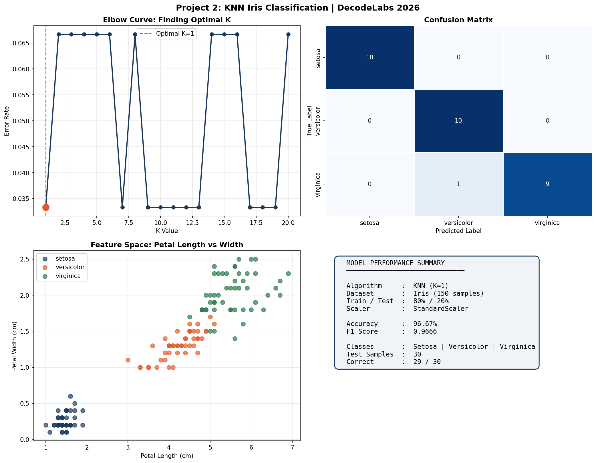

# Iris KNN Classifier

## Overview
This project uses the K-Nearest Neighbors (KNN) algorithm to classify Iris flower species using the classic Iris benchmark dataset.

## Features
- Data exploration
- Feature scaling
- Elbow method
- KNN classification
- Confusion matrix
- Accuracy and F1 score evaluation
- Prediction on unseen samples

## Dataset
The project uses the Iris dataset provided by scikit-learn.

## Workflow
1. Load dataset
2. Scale features
3. Split training and testing data
4. Find optimal K
5. Train model
6. Evaluate performance
7. Generate visualizations
8. Predict new samples

## Results


## Technologies Used
- Python
- NumPy
- Pandas
- Matplotlib
- Seaborn
- Scikit-learn

## Run Locally

```bash
pip install -r requirements.txt
python iris_classifier.py
```
