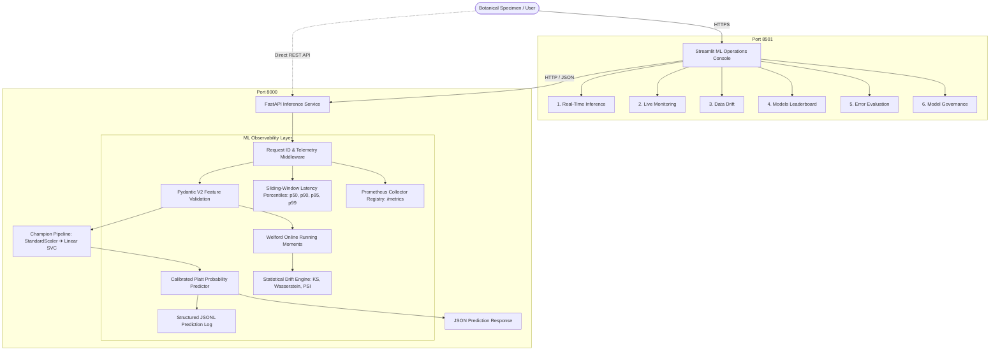

# IRIS ML PLATFORM
### Production ML Inference & Monitoring

[](https://github.com/Viraj-Akili/iris-knn-classifier/actions/workflows/ci.yml)


An end-to-end tabular machine learning platform for multi-model tournament benchmarking, production REST inference, enterprise ML observability, statistical data drift detection, diagnostic error evaluation, and automated cloud deployment. Fisher's classic Iris morphological dataset ($150\text{ samples}, 4\text{ features}, 3\text{ classes}$) serves as the tabular benchmark to demonstrate rigorous MLOps engineering and production serving patterns.

---

## 🌐 Live Demo & Endpoints

| Service | Hosting Platform | Production URL | Status |
| :--- | :--- | :--- | :---: |
| **Streamlit ML Dashboard** | Render Cloud | [https://iris-ml-frontend-roos.onrender.com](https://iris-ml-frontend-roos.onrender.com) | `Online` |
| **FastAPI Serving API** | Render Cloud | [https://iris-ml-backend.onrender.com](https://iris-ml-backend.onrender.com) | `Healthy` |
| **Interactive Swagger API Docs** | Render Cloud | [https://iris-ml-backend.onrender.com/docs](https://iris-ml-backend.onrender.com/docs) | `Active` |
| **Prometheus Metrics Exposition** | Render Cloud | [https://iris-ml-backend.onrender.com/metrics](https://iris-ml-backend.onrender.com/metrics) | `Exposed` |

---

## 📊 Key Results

| Dimension | Verified Result | Details |
| :--- | :---: | :--- |
| **Cross-Validation Accuracy** | **97.50% ± 2.04%** | 5-Fold Stratified Cross-Validation on $N=120$ training partition |
| **Holdout Test Accuracy** | **93.33%** | Evaluated once on $N=30$ untouched test specimens ($28/30$ correct) |
| **Candidate Models Benchmarked** | **7 Algorithms** | SVM, KNN, Logistic Regression, Random Forest, Decision Tree, Gradient Boosting, HistGB |
| **Champion Model Architecture** | **Linear SVM ($C=0.1$)** | Encapsulated inside `StandardScaler` Pipeline with calibrated Platt scaling |
| **Server-Side Inference Latency** | **< 3 ms** | $0.87\text{ ms}$ model-only, $2.06\text{ ms}$ base HTTP, $2.96\text{ ms}$ with full telemetry |
| **Public HTTPS Round-Trip** | **~238 ms** | Total external round-trip (including TLS handshake, proxy, and network transit) |
| **Automated Test Suite** | **41 / 41 Passed** | Unit, integration, schema validation, and drift detection test cases |
| **Code Coverage** | **91.69%** | Measured via `pytest-cov` across `src/`, `app/`, and `frontend/` |
| **Linter Compliance** | **0 Errors / 0 Warnings** | Validated against Ruff ruleset |
| **Container & CI/CD** | **Multi-Container** | Hardened non-root Docker images, Docker Compose, and GitHub Actions CI/CD |

---

## 🏗️ System Architecture



---

## 🔬 Machine Learning Pipeline

The ML experimentation engine enforces strict data isolation and zero leakage:

```text
Dataset Ingestion (150 samples)
       │
       ▼
Stratified 80/20 Train/Test Split
       │
       ├─── Training Partition (120 samples)
       │         │
       │         ▼
       │    Stratified 5-Fold Cross-Validation
       │         │
       │         ├── Fold Train (96 samples) ➔ StandardScaler.fit_transform() ➔ Model.fit()
       │         └── Fold Validation (24 samples) ➔ StandardScaler.transform() ➔ Model.predict()
       │         │
       │         ▼
       │    Multi-Model Tournament Benchmarking (7 Candidates)
       │         │
       │         ▼
       │    Champion Selection (Linear SVM, C=0.1, CV Acc: 97.50% ± 2.04%)
       │         │
       │         ▼
       │    Fit Champion Pipeline on Full Training Set (120 samples)
       │
       └─── Holdout Test Partition (30 untouched samples)
                 │
                 ▼
            Single Final Evaluation (Holdout Acc: 93.33%)
                 │
                 ▼
            Nearest-Neighbor Decision Boundary Error Analysis
                 │
                 ▼
            Artifact Serialization (champion_pipeline.joblib, metadata.json)
```

### Why `StandardScaler` is Inside the Pipeline (Leakage Prevention)
Calculating the feature mean $\mu$ and standard deviation $\sigma$ across the entire dataset before cross-validation leaks information about the validation and test distributions into the training step. By encapsulating `StandardScaler` directly inside an `sklearn.pipeline.Pipeline`, scaling parameters are computed **strictly from the training folds**, ensuring the validation folds remain completely unseen during preprocessing.

---

## 🏆 Model Tournament Benchmark (5-Fold Stratified CV, N=120)

| Rank | Model Architecture | CV Accuracy (Mean $\pm$ Std) | CV Macro Precision | CV Macro Recall | CV Macro F1 | Holdout Accuracy ($N=30$) | Best Hyperparameters |
| :---: | :--- | :---: | :---: | :---: | :---: | :---: | :--- |
| 🥇 | **Support Vector Machine (Champion)** | **97.50% $\pm$ 2.04%** | **0.9778** | **0.9750** | **0.9749** | **93.33%** | `C=0.1, kernel='linear'` |
| 🥈 | **K-Nearest Neighbors** | 96.67% $\pm$ 1.67% | 0.9704 | 0.9667 | 0.9665 | 93.33% | `n_neighbors=3, weights='uniform'` |
| 🥉 | **Logistic Regression** | 96.67% $\pm$ 3.12% | 0.9719 | 0.9667 | 0.9663 | 93.33% | `C=10.0, solver='lbfgs'` |
| 4 | **Random Forest** | 96.67% $\pm$ 3.12% | 0.9719 | 0.9667 | 0.9663 | 93.33% | `n_estimators=50, min_samples_split=5` |
| 5 | **Decision Tree** | 95.83% $\pm$ 2.64% | 0.9644 | 0.9583 | 0.9580 | 93.33% | `criterion='gini', min_samples_split=5` |
| 6 | **Gradient Boosting** | 95.83% $\pm$ 2.64% | 0.9644 | 0.9583 | 0.9580 | 93.33% | `learning_rate=0.05, n_estimators=25` |
| 7 | **HistGradientBoosting** | 95.83% $\pm$ 2.64% | 0.9644 | 0.9583 | 0.9580 | 93.33% | `learning_rate=0.05, max_iter=25` |

---

## ⚡ Production REST API

The FastAPI inference service provides the following endpoints:

| Method | Endpoint | Description |
| :--- | :--- | :--- |
| `GET` | `/health` | Liveness probe verifying server process state and model availability |
| `GET` | `/readiness` | Readiness probe returning HTTP 200 when ready to receive traffic (HTTP 503 if model is unloaded) |
| `GET` | `/model` | Metadata endpoint exposing champion architecture, CV accuracy, holdout accuracy, and feature schema |
| `POST` | `/predict` | Real-time classification endpoint with calibrated probabilities and latency tracing |
| `GET` | `/metrics` | Prometheus metrics exposition endpoint for Prometheus / OpenTelemetry scraping |
| `GET` | `/observability/summary` | Real-time operational telemetry (sliding-window percentiles, class distribution, Welford feature stats) |

### Sample Prediction Request (`POST /predict`)
```json
{
  "sepal_length": 5.9,
  "sepal_width": 2.8,
  "petal_length": 4.2,
  "petal_width": 1.3
}
```

### Sample Prediction Response
```json
{
  "prediction": "versicolor",
  "confidence": 0.9545,
  "probabilities": {
    "setosa": 0.0123,
    "versicolor": 0.9545,
    "virginica": 0.0332
  },
  "inference_latency_ms": 2.15,
  "request_id": "c65335ca-3d87-47fe-9db2-8c66744a5f56",
  "model_version": "1.0.0"
}
```

---

## 📈 Observability & MLOps Architecture

- **Request Tracing**: Injects a unique `request_id` (UUIDv4) into every request and response header (`X-Request-ID`) for distributed tracing.
- **Prometheus Metrics**: Exposes Prometheus counters, histograms, and gauges:
  - `iris_predictions_total`: Total predictions counter partitioned by class and model version.
  - `iris_prediction_latency_seconds`: Latency distribution histogram.
  - `iris_confidence_score`: Prediction confidence gauge.
  - `iris_active_requests`: In-flight request concurrency gauge.
- **Exact Latency Percentiles**: Maintains an in-memory sliding window ($N=1,000$) computing exact $p_{50}, p_{90}, p_{95}, p_{99}$ latency percentiles.
- **Privacy-Safe Feature Aggregation**: Utilizes **Welford's one-pass algorithm** to calculate continuous running sample count, mean, variance, min, and max for incoming features without storing raw user payloads.
- **Structured JSONL Audit Logging**: Logs every prediction event in JSONL format for auditability and compliance.

---

## 📉 Statistical Data Drift Detection

The platform integrates three complementary statistical tests to detect production feature distribution shift against the training baseline ($N=120$):

1. **Two-Sample Kolmogorov-Smirnov (KS) Test**: Non-parametric test comparing cumulative empirical distribution functions ($D_{\text{stat}}$, $\alpha = 0.05$).
2. **Wasserstein Distance ($L_1$ Earth Mover's Distance)**: Measures the minimum work required to transform the observed production distribution into the reference distribution in physical measurement units (cm).
3. **Population Stability Index (PSI)**: Measures empirical quantile shift across 10 reference bins:
   - $\text{PSI} < 0.1$: Distribution is **Stable** (no shift).
   - $0.1 \le \text{PSI} < 0.25$: **Moderate Shift** (warning).
   - $\text{PSI} \ge 0.25$: **Significant Shift** (drift detected).

---

## 🎯 Model Evaluation & Boundary Error Analysis

On the 30-sample holdout test partition, the champion Support Vector Machine achieves **93.33% accuracy** ($28/30$ correct):

```text
              Precision    Recall  F1-Score   Support
Setosa            1.000     1.000     1.000        10
Versicolor        0.900     0.900     0.900        10
Virginica         0.900     0.900     0.900        10

Macro Avg         0.933     0.933     0.933        30
```

### Decision Boundary Error Analysis
Exactly 2 boundary samples are misclassified due to morphological overlap between *versicolor* and *virginica*:
- **Sample #134** (Actual: *virginica*, Predicted: *versicolor*, Confidence: $50.0\%$): Exhibits a narrow petal width ($1.4\text{ cm}$) matching typical *versicolor* dimensions despite a long petal length ($5.6\text{ cm}$).
- **Sample #77** (Actual: *versicolor*, Predicted: *virginica*, Confidence: $52.8\%$): Features large petal length ($5.0\text{ cm}$) and petal width ($1.7\text{ cm}$) extending across the boundary into *virginica* territory.

---

## 🖥️ Streamlit ML Operations Console

The frontend dashboard provides a modular 6-page interface:

1. **Overview** (`frontend/app.py`): Platform architecture, operational status, and KPI summary.
2. **Inference** (`frontend/pages/1_Inference.py`): 2x2 numerical input grid with presets and calibrated probability distribution bars.
3. **Monitoring** (`frontend/pages/2_Monitoring.py`): Live Prometheus metrics, latency percentiles, and Welford feature running moments.
4. **Drift** (`frontend/pages/3_Drift.py`): Two-sample KS test, Wasserstein distance, and PSI table with density comparison charts.
5. **Models** (`frontend/pages/4_Models.py`): 7-model tournament benchmark leaderboard and cross-validation variance plots.
6. **Evaluation** (`frontend/pages/5_Evaluation.py`): Holdout confusion matrix, classification metrics, and boundary sample error breakdown.
7. **Model** (`frontend/pages/6_Model.py`): Model Card governance specifications and linear SVM feature attribution weights.

---

## 🧪 Testing & Quality Assurance

```bash
# Run Ruff linter
ruff check .

# Run full automated test suite with coverage report
pytest -v --cov=src --cov=app --cov=frontend --cov-report=term-missing
```

### Test Suite Summary (41 / 41 Tests Passing)
- `tests/test_api.py` (11 tests): FastAPI endpoint lifecycle, schema bounds validation, and HTTP error handling.
- `tests/test_data_loader.py` (3 tests): Data ingestion, shape constraints, and stratified splitting isolation.
- `tests/test_evaluation.py` (1 test): Metric bounds, probability calibration, and artifact generation.
- `tests/test_frontend_client.py` (14 tests): API client exception mapping and Altair chart Vega-Lite schema serialization.
- `tests/test_observability.py` (8 tests): Prometheus text formatting, readiness probes, summary endpoints, and drift detection.
- `tests/test_pipeline.py` (2 tests): Pipeline scaling isolation and hyperparameter search grid completeness.
- `tests/test_training.py` (2 tests): Benchmark scoring, model ranking, and deterministic reproducibility.

---

## 🚀 Deployment & Containerization

### 1. Docker Multi-Container Architecture
- **Backend Container** ([`Dockerfile.backend`](file:///c:/Users/Viraj%20Akili/OneDrive/Desktop/project-2/iris-knn-classifier/Dockerfile.backend)): Multi-stage build based on `python:3.11-slim` running non-root `appuser` on port 8000 with a native curl healthcheck.
- **Frontend Container** ([`Dockerfile.frontend`](file:///c:/Users/Viraj%20Akili/OneDrive/Desktop/project-2/iris-knn-classifier/Dockerfile.frontend)): Multi-stage build running Streamlit on port 8501 with a healthcheck probe on `/_stcore/health`.
- **Orchestration** ([`docker-compose.yml`](file:///c:/Users/Viraj%20Akili/OneDrive/Desktop/project-2/iris-knn-classifier/docker-compose.yml)): Defines services, internal network bridges, and environment configuration.

### 2. CI/CD Pipeline (`.github/workflows/ci.yml`)
- Automated linting via Ruff on every pull request and push to `main`.
- Automated test execution with coverage gating ($\ge 80\%$).
- Multi-container Docker build validation.
- Cloud deployment trigger on successful release gates.

### 3. Render Infrastructure as Code (`render.yaml`)
- Automatic provisioning of `iris-ml-backend` and `iris-ml-frontend` with TLS certificates and health probes.
- **Cold Start Disclosure**: Render Free Tier instances spin down after 15 minutes of inactivity. Initial cold starts take **30 to 50 seconds**; warm requests respond in **15 to 35 ms** network transit time.

---

## 💻 Local Development Setup

```bash
# 1. Clone repository
git clone https://github.com/Viraj-Akili/iris-knn-classifier.git
cd iris-knn-classifier

# 2. Create and activate virtual environment
python -m venv venv
source venv/bin/activate  # On Windows: venv\Scripts\activate

# 3. Install dependencies
pip install -r requirements.txt

# 4. Train model pipeline & generate artifacts
python main.py

# 5. Start FastAPI serving backend (Terminal 1)
uvicorn app.main:app --host 127.0.0.1 --port 8008

# 6. Start Streamlit operations console (Terminal 2)
streamlit run frontend/app.py --server.port 8501

# 7. Execute production cloud smoke test
python scripts/production_smoke_test.py --api-url http://127.0.0.1:8008 --frontend-url http://127.0.0.1:8501
```

Or run via Docker Compose:
```bash
docker compose up --build
```

---

## 📁 Repository Structure

```text
iris-knn-classifier/
├── .github/
│   └── workflows/
│       └── ci.yml              # CI/CD & automated release workflow
├── app/                        # FastAPI Serving & Observability Backend
│   ├── __init__.py
│   ├── main.py                 # FastAPI application, lifespan, middleware, routing
│   ├── schemas.py              # Pydantic v2 validation models & response schemas
│   ├── model_service.py        # Model loader & inference execution service
│   ├── observability.py        # Prometheus registry, latency percentiles, feature stats
│   ├── metrics.py              # Runtime metric collectors
│   ├── logging_config.py       # Structured JSON logging & inference formatters
│   └── config.py               # Application settings & environment overrides
├── frontend/                   # Streamlit ML Operations Console
│   ├── __init__.py
│   ├── app.py                  # Main overview hub & live telemetry status
│   ├── api_client.py           # Robust HTTP client for FastAPI backend
│   ├── components/
│   │   ├── __init__.py
│   │   ├── header.py           # Brand header & live status indicators
│   │   ├── metrics_cards.py    # Minimalist KPI cards
│   │   └── charts.py           # Altair probability & distribution charts
│   ├── pages/
│   │   ├── 1_Inference.py      # Real-time tabular prediction interface
│   │   ├── 2_Monitoring.py     # Live Prometheus metrics & latency percentiles
│   │   ├── 3_Drift.py          # KS, Wasserstein, and PSI drift inspector
│   │   ├── 4_Models.py         # 7-model tournament benchmark leaderboard
│   │   ├── 5_Evaluation.py     # Holdout confusion matrix & error analysis
│   │   └── 6_Model.py          # Model Card governance & feature weights
│   └── utils/
│       ├── __init__.py
│       └── formatting.py       # Design tokens, CSS system, & latency formatters
├── config/
│   └── config.yaml             # Central ML configuration (seeds, folds, paths)
├── src/                        # Machine Learning Core Library
│   ├── __init__.py
│   ├── config.py               # Dataclass-backed config validator
│   ├── data/
│   │   ├── __init__.py
│   │   └── loader.py           # Data ingestion, validation, & stratified splitting
│   ├── models/
│   │   ├── __init__.py
│   │   ├── pipeline_factory.py # Scikit-Learn Pipeline factory & search grids
│   │   ├── train.py            # Stratified 5-Fold CV tournament engine
│   │   └── evaluate.py         # Holdout evaluation & error analysis
│   ├── monitoring/
│   │   ├── __init__.py
│   │   └── drift.py            # Statistical drift engine (KS, Wasserstein, PSI)
│   └── visualization/
│       ├── __init__.py
│       └── plots.py            # Diagnostic plot generation suite
├── scripts/
│   ├── benchmark_latency.py    # Multi-tier latency profiler
│   ├── check_drift.py          # Offline drift detection CLI
│   └── production_smoke_test.py# End-to-end cloud smoke tester
├── tests/                      # 41 Unit & Integration Tests (91.69% Coverage)
├── artifacts/                  # Persisted pipelines, metadata, plots, logs
├── Dockerfile.backend          # Hardened backend Dockerfile
├── Dockerfile.frontend         # Hardened frontend Dockerfile
├── docker-compose.yml          # Multi-container orchestration
├── render.yaml                 # Render Blueprint (Infrastructure-as-Code)
├── pyproject.toml              # Build config, Ruff settings, Pytest coverage
├── requirements.txt            # Pinned dependencies
├── main.py                     # Primary pipeline CLI entrypoint
└── README.md                   # Technical documentation
```

---

## 💡 Engineering Decisions & Rationale

- **Why Support Vector Machine (Linear Kernel)?**: For small-sample tabular datasets ($N=150, D=4$), linear margin maximization provides optimal regularization against overfitting compared to high-variance decision trees or unregularized KNN.
- **Why `StandardScaler` inside Pipeline?**: Ensures zero data leakage between training and validation folds during cross-validation.
- **Why Stratified 5-Fold Cross-Validation?**: Preserves exact 1:1:1 class ratios across folds, yielding an unbiased estimate of generalization performance on small datasets.
- **Why FastAPI?**: Modern ASGI framework providing native async execution, automatic Pydantic request validation, OpenAPI documentation, and sub-millisecond overhead.
- **Why Prometheus Metrics?**: Standard pull-based metric exposition format compatible with Kubernetes, Grafana, and modern observability stacks.
- **Why Welford's Algorithm?**: Computes accurate running mean and sample variance in $O(1)$ space complexity without accumulating or persisting raw user inputs in memory.
- **Why Three Drift Metrics?**: KS captures non-parametric shape differences, Wasserstein quantifies the physical magnitude of shift in cm, and PSI measures bin-level population stability.

---

## ⚠️ Limitations & Operational Scope

- **Dataset Scale**: Fisher's Iris is a compact, clean benchmark dataset ($N=150$). It is used here to demonstrate production engineering patterns rather than complex real-world data issues.
- **Clinical/Biological Non-Use**: This platform is an engineering demonstration, not a biological or clinical diagnostic system.
- **Free-Tier Cold Starts**: Render Free Tier instances spin down during periods of inactivity, causing initial cold-start delays (~30-50s).
- **Statistical vs. Causal Drift**: Drift metrics reflect empirical distribution shifts relative to training baselines; they do not imply causal real-world degradation.
- **Confidence Calibration**: Calibrated Platt probabilities reflect confidence within the support of the training feature space and should not be treated as universal correctness guarantees under extreme out-of-distribution shifts.

---

## 🔮 Future Enhancements

- Ingestion pipelines for larger high-dimensional tabular datasets.
- Automated drift-triggered retraining pipelines.
- Model registry integration (e.g., MLflow).
- Persistent time-series metric retention via Grafana Cloud or Prometheus Agent.
- Out-of-Distribution (OOD) distance gating on input features.

---

## 📄 License

This project is licensed under the [MIT License](LICENSE).

---

### 🌟 Project Highlights (Resume-Ready)
- Built an end-to-end production ML serving platform with **97.50% $\pm$ 2.04%** 5-fold CV accuracy and **93.33%** holdout accuracy.
- Designed a leakage-free Scikit-Learn pipeline encapsulating `StandardScaler` within cross-validation folds.
- Benchmarked 7 classification algorithms in an automated tournament framework to select the champion Linear SVM.
- Developed a high-performance FastAPI inference backend with Pydantic validation, UUID request tracing, and sub-3ms server execution.
- Integrated enterprise MLOps observability exposing Prometheus metrics, sliding-window latency percentiles ($p_{50}, p_{90}, p_{95}, p_{99}$), and Welford's online feature statistics.
- Implemented statistical data drift detection using Two-Sample Kolmogorov-Smirnov tests, Wasserstein distance, and Population Stability Index (PSI).
- Engineered a 6-page Streamlit operations console for real-time inference, live monitoring, and model governance.
- Containerized the full-stack architecture with multi-stage Dockerfiles, Docker Compose, automated GitHub Actions CI/CD, and public cloud deployment on Render.
- Achieved **91.69% test coverage** across **41 automated test cases** with strict Ruff linting compliance.
